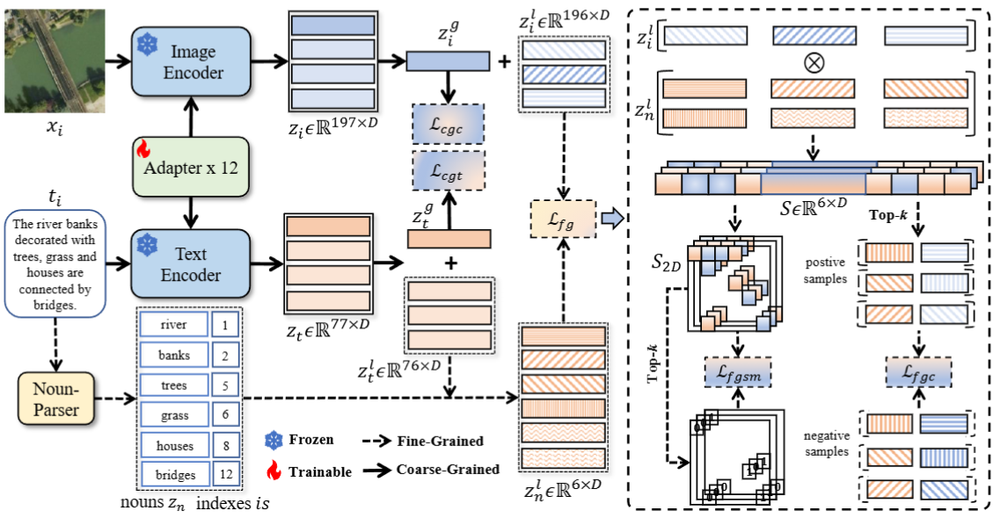
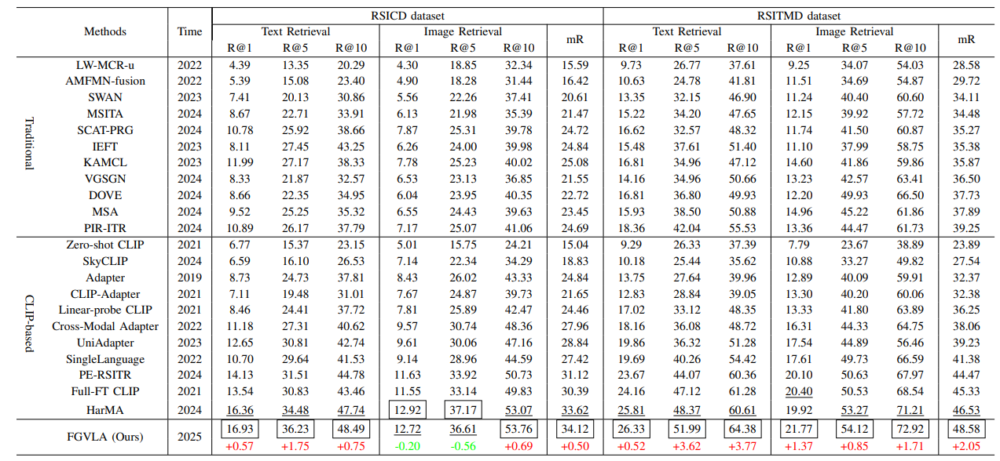
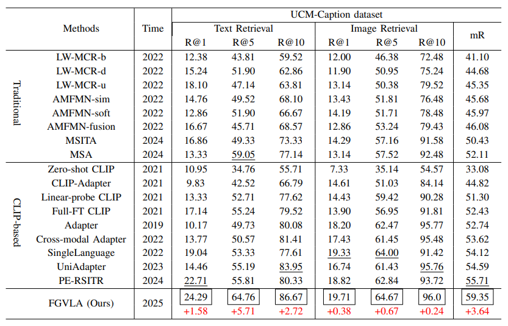

# FGVLA
## Abstract
Remote sensing image-text retrieval (RSITR) is critical for applications, including environmental monitoring and disaster management. The main challenge in this field is that the multi-scale feature of remote sensing images and the semantic differences of professional texts make it difficult to achieve accurate alignment. Existing coarse-grained methods struggle to address the inherent difference between images and text. In light of this, we propose the Fine-Grained Visual-Language Alignment (FGVLA) method. Our FGVLA employs a hybrid loss function that combines coarse-grained contrastive and triplet loss with novel fine-grained loss. Fine-grained loss includes spatial mask loss and fine-grained contrastive loss to enhance semantic alignment. The method also introduces an inference process that works cooperatively with fine-grained loss to explicitly align image patches with textual nouns. Extensive experiments on RSICD, RSITMD, and UCM-Caption datasets demonstrate that FGVLA outperforms existing methods, achieving superior retrieval performance. 

## Method



## Download

The model is based on the [open_clip/models--laion--CLIP-ViT-B-32-laion2B-s34B-b79K/open_clip_pytorch_model.bin](https://huggingface.co/laion/CLIP-ViT-B-32-laion2B-s34B-b79K)


All experiments are based on the [RSITMD](https://github.com/xiaoyuan1996/AMFMN/tree/master/RSITMD), [RSICD](https://github.com/201528014227051/RSICD_optimal), and [UCM-Caption](https://github.com/201528014227051/RSICD_optimal) datasets.


## Environment

Set up the environment by running:

```shell
conda env create -f environment.yml
```


## Train

```python
python pipeline.py
```

## Results

Results on RSICD and RSITMD datasets are as follows:



Results on UCM-Caption dataset are as follows:




## References

This code builds upon the excellent work of https://github.com/LiShuo1001/POSAPL and https://github.com/seekerhuang/HarMA